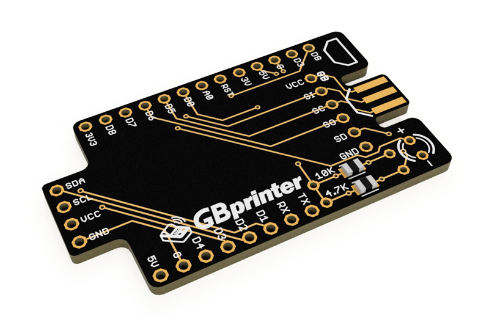

# Game Boy WiFi Printer - D1 Mini Shield

<a href="https://oshpark.com/shared_projects/KH3ALIwH"></img></a>

Enthusiasts on the Game Boy Camera Club discord server (http://bit.ly/gbccd) have been working on a Game Boy Printer emulator project based on ESP2866 D1 mini boards. Taking inspiration from other projects like the [Gameboy Link Cable Breakout PCB](https://github.com/Palmr/gb-link-cable), I created this shield board to add a link connector and pinouts for an oled screen.

The board is designed with two options for the oled screen placement. There are mousebite perferations to trim the board if you plan on using the smaller layout only.

Here's a render of the PCB:

Here's a photo of an assembled prototype using a D1 mini Pro board:

You can get help with this project and find info on the software that runs on the ESP by joining the Game Boy Camera Club discord server (http://bit.ly/gbccd