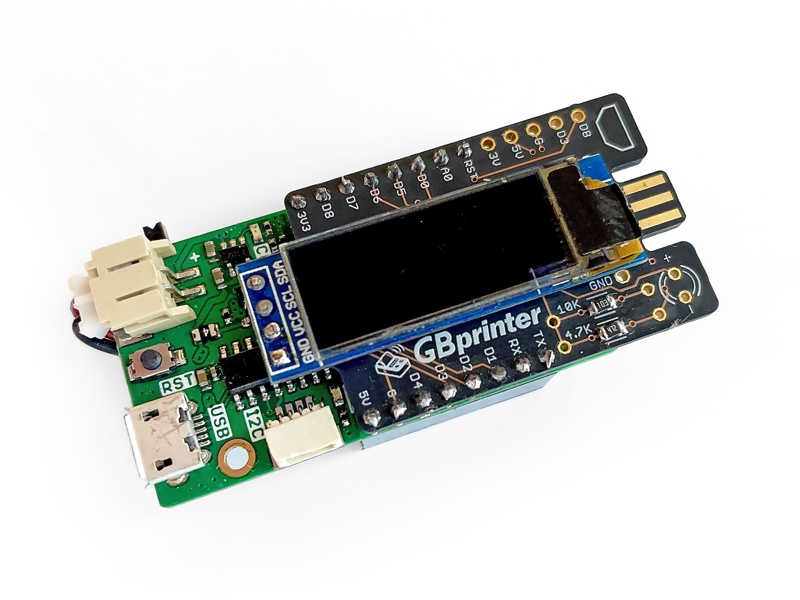

# Game Boy WiFi Printer - D1 Mini Shield  

<a href="https://oshpark.com/shared_projects/KH3ALIwH"></img></a>

Enthusiasts on the [Game Boy Camera Club discord server](http://bit.ly/gbccd) have been working on a Game Boy Printer emulator project based on ESP8266 D1 mini boards. Taking inspiration from other projects like the [Gameboy Link Cable Breakout PCB](https://github.com/Palmr/gb-link-cable), I created this shield board to add a link connector and pinouts for an oled screen.

The board is designed with two options for the oled screen placement. There are mousebite perferations to trim the board if you plan on using the smaller layout only.

Here's a render of the PCB  


# Recommended D1 mini Boards:  
**LOLIN D1 mini Pro** - https://www.aliexpress.com/item/32724692514.html  
LiPo battery connector, charge circuit included. No power switch.

**LILYGO TTGO D1 mini** - https://www.aliexpress.com/item/4001144115302.html  
16340 battery holder, charge curcuit, and power switch included.

**LOLIN D1 mini** - https://www.aliexpress.com/item/32529101036.html  
No battery connector, charge curcit, or power switch included.

# Assembled Printer Example  
Here's a photo of an assembled printer using a D1 mini Pro board:  


# Components  
Besides the ESP8266 board, this shield uses the following components:

* 1× 4.7kΩ resistor (*required*)
* 1× 128×32 OLED display (*optional, recommended*)
* 1× 3.5mm LED (*optional*)

Placements for the components are clearly marked on the board's silkscreen. Find the resistor on the bottom of the PCB.

# Compatible Software  
This shield breaks out appropriate pins for the Game Boy Link port that is part of the PCB itself. This hardware is suitable for both the [Arduino Game Boy Printer Emulator](https://github.com/mofosyne/arduino-gameboy-printer-emulator) as well as the [WiFi Game Boy Printer Emulator](https://github.com/HerrZatacke/wifi-gbp-emulator)

When using this with the WiFi Game Boy Printer Emulator, you can uncomment and adjust the pin on the following lines in your `config.h` file to detect a connected and powered on Game Boy to auto switch into print mode:  
```
// Sense boot mode lets you use the signal on pin GB_5V_OUT to determine printer/server mode
#define SENSE_BOOT_MODE
#define GB_5V_OUT 15
```

If you've added the optional OLED display, you can uncomment and adjust the pins on the following lines in your `config.h` file:  
```
// Uncomment if using an adafruit oled display
#define USE_OLED
// Alternative OLED Pins
#define OLED_SDA 4
#define OLED_SCL 5
```

# Usage 

When connecting a Game Boy Link cable to the shield, check the silkscreen for indicators on which side should be placed up. (The flat side of the connector should face down and the rounded side should face up, the same side as the OLED screen.)

You can get help with this project and find info on the software that runs on the ESP by joining the [Game Boy Camera Club discord server](http://bit.ly/gbccd)